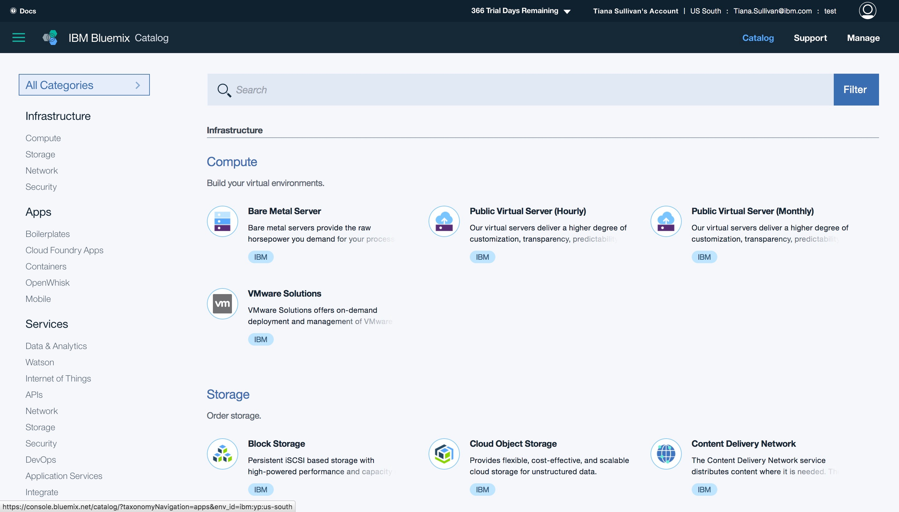
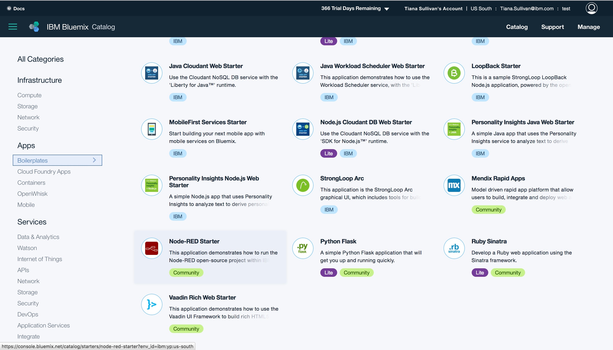
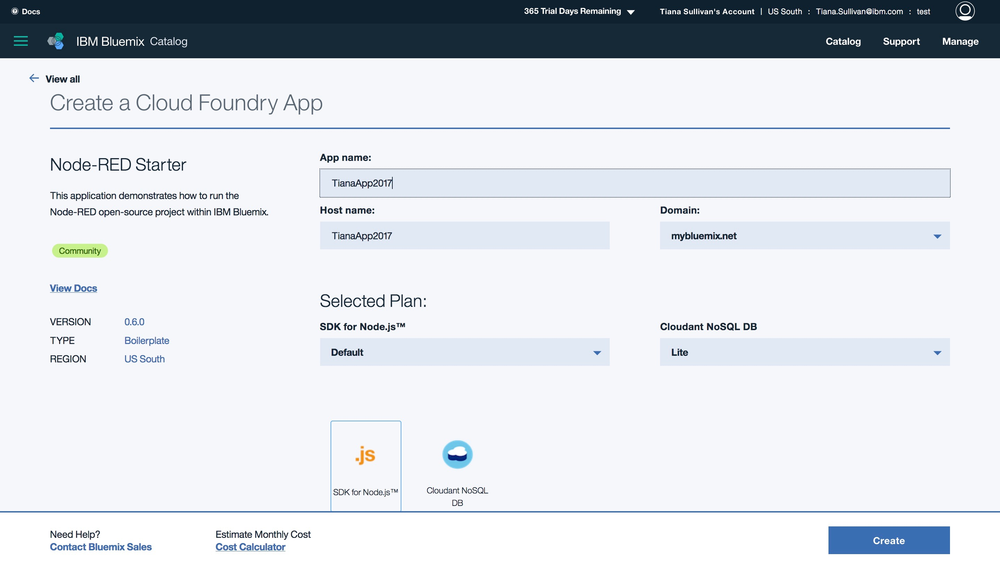
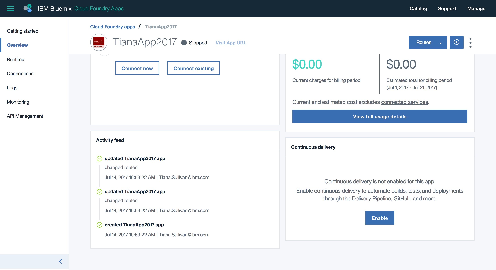
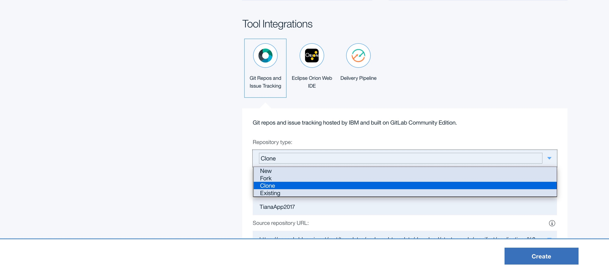
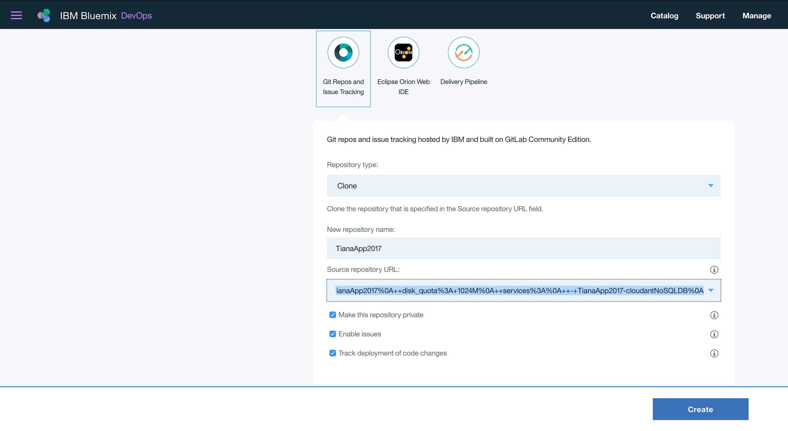
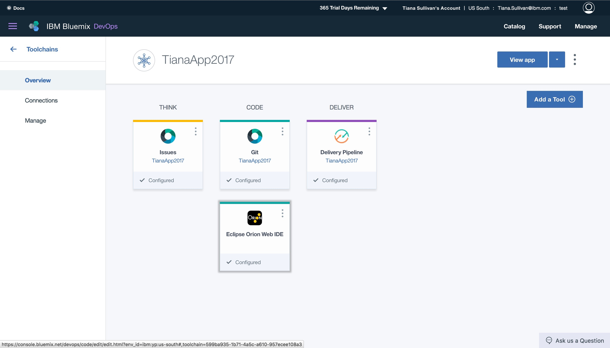
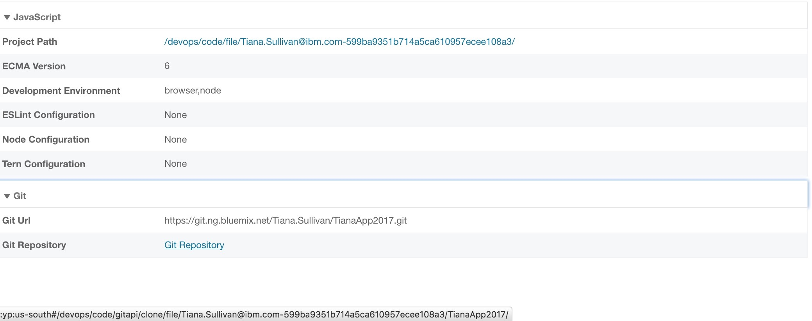
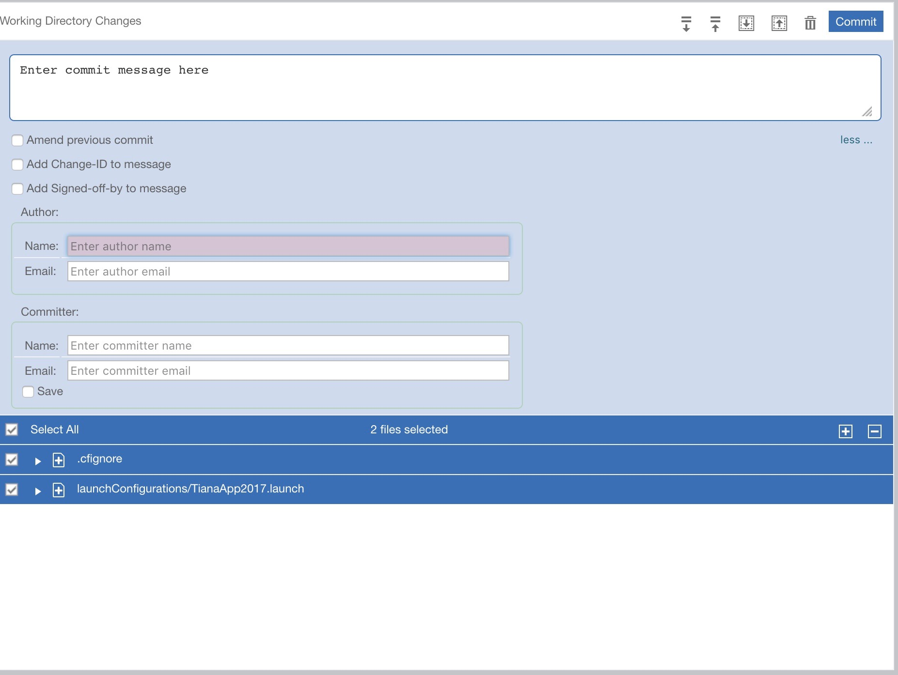
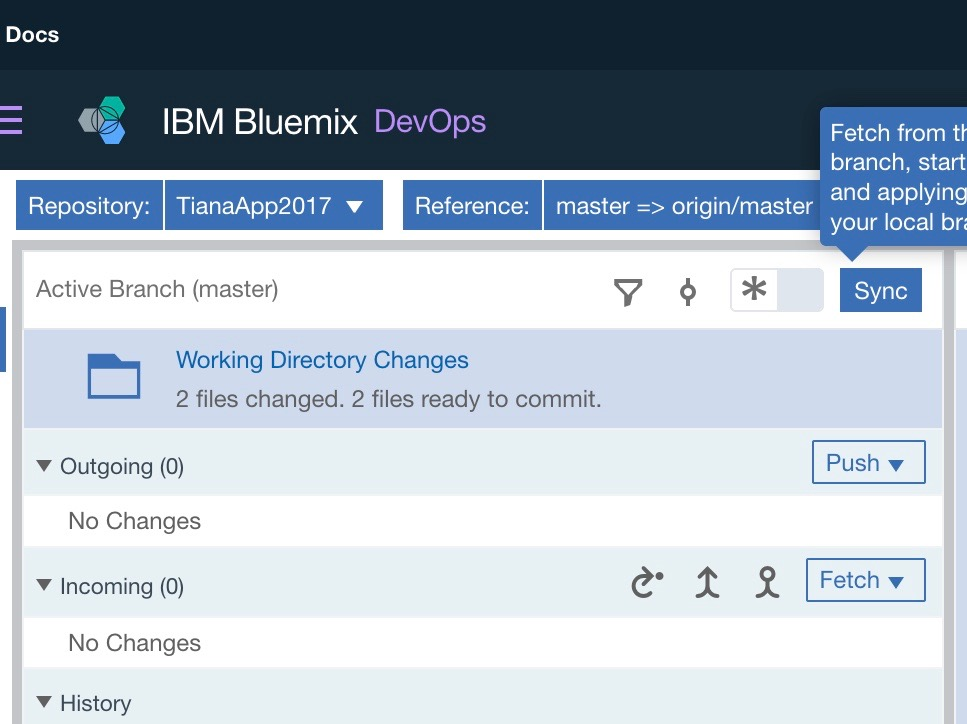

Deploy Node-RED Bluemix Tweet Explorer Starter Application via the Bluemix Dashboard
====================================

## Prequisites
1. [A Bluemix account](https://console.bluemix.net)
2. [A Github account](https://github.com/login)

##Create Using Your Bluemix Dashboard

1. Login into your IBM Bluemix account. If you do not have an IBM Bluemix account then create one.
2. Select the catalog option located in the top right corner.

3. In the catalog, select a Node-RED boilerplate.

4. Create a unique name for your application and select a pricing plan.

5. Click 'Create'.
6. In the overview tab, enable Continous Delivery.

7. Create toolchain by cloning your git repositiory

8. In the Source Repository url, delete the url in the input box and change it to the source of your git repository. Tab out to save the changes.

9. Click 'Create'.
10. After the toolchain is created, go inside the Eclispe Orion Web IDE.

11. Change your manifest.yml and package.json files to have the same app and host name as in step 4.

12. In the Git tab located at the bottom of the page, open the tab and click the Git repository url.

13. Commit the app by entering in a comment and the required name and email.

14. Use the sync button to push the application. 

#You have sucessfully deployed your application!

