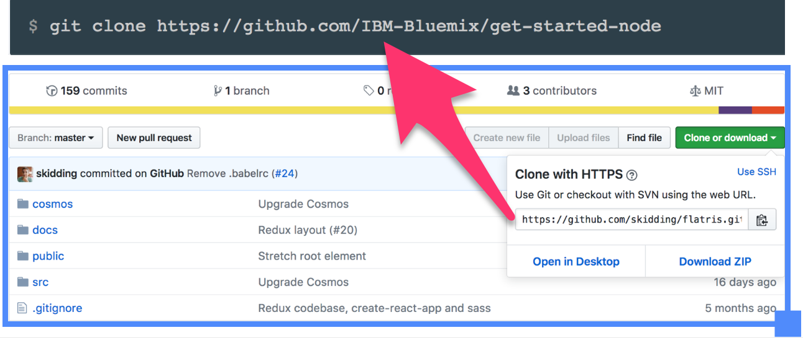
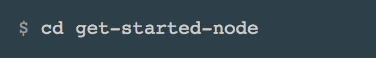
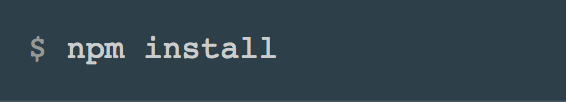
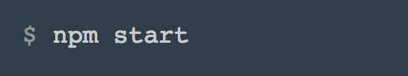
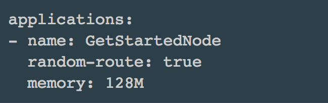
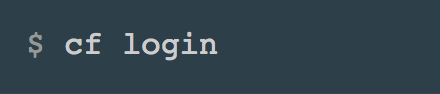
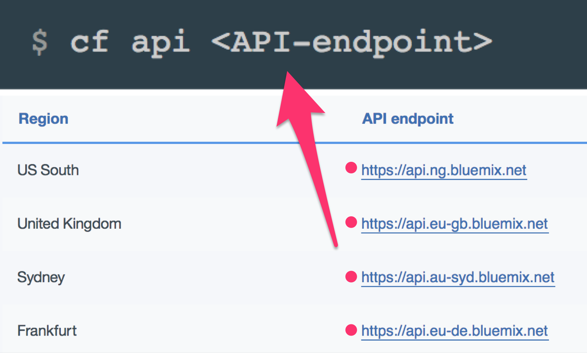
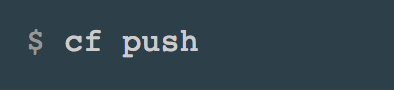

Deploy Node-RED Bluemix Tweet Explorer Starter Application via Command Line Interface
====================================

## Prequisites
1. [A Bluemix account](https://console.bluemix.net)
2. [A Github account](https://github.com/login)
3. [Install Git Locally](https://git-scm.com/downloads)
4. [Install Cloud Foundry Command Line Interface](https://github.com/cloudfoundry/cli#downloads)
5. [Install Node.js Locally](https://nodejs.org/en/)

##Clone the App
1. Clone the App from Github
    
    

## Run the App Locally

1. Cd into the app directory
	
	
2. Run `npm install` to install the app's dependencies
	
	 
3. Run `npm start` to start the app 
	
	
4. Access the running app in a browser at http://localhost:3000

##Prepare App for Deployment 
1. Open the manifest.yml file, and change the name from `the orginal app name` to `your app name`.
	
	 

##Deploy the App
1. Login into BlueMix 

	
2. Run the following command to set your API endpoint, replacing the API-endpoint value with the API endpoint for your region. 
	
	
3. From within the application directory on your machine, push the application to bluemix

	
4. View your application at the address in the output of your push command

##Congratulations!! You have successfully deployed an application to BlueMix

