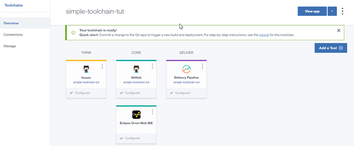

Deploy Node-RED Bluemix Tweet Explorer Starter Application via Toolchains
====================================

##Prerequisites
1.	A Bluemix account. The account is free and provides access to everything you need to develop, track, plan, and deploy apps. Sign up for a trial of Bluemix. The account requires an IBMid. If you don't have an IBMid, you can create one when you register. Bluemix is an open-standards, cloud-based platform for building, running, and managing apps.
2.	A GitHub account. If you don't have one, sign up.
3.	Verify the toolchains and tool integrations that are available in your region and Bluemix environment. A toolchain is a set of tool integrations that support development, deployment, and operations tasks.
  

#Deploying an Application to BlueMix from the Command Line

## Prequisites
1. [A Bluemix account](https://console.bluemix.net)
2. [A Github account](https://github.com/login) 
3. [Install Git aocally](https://git-scm.com/downloads)
4. Verify the toolchains and tool integrations that are available in your region and Bluemix environment. A toolchain is a set of tool integrations that support development, deployment, and operations tasks.

## Create and toolchain and Deploy
1. Log Into Bluemix account
2. In the upper-left corner of the banner, click the Menu icon.click Services and then click DevOps.   
   
   
	
	
3. On the DevOps dashboard, on the Toolchains page, click Create a Toolchain.
	
	![On the DevOps dashboard, on the Toolchains page, click Create a Toolchain.].(./images/md/toolchain/toolchain-step1-3.png)
4.	Choose the Simple Cloud Foundry toolchain.
	
	
5. On the creation page, review the diagram of the toolchain that you are about to create. The diagram shows each tool integration in its lifecycle phase in the toolchain.
	
	
6.	If you haven't authorized with GitHub, you are prompted to do so. Click Authorize and follow the instructions to link your Bluemix account to a GitHub account.
	
	
7.	Review the default information for the toolchain settings. The toolchain's name identifies it in Bluemix. Toolchains are defined across an org. If you want to use a different org or name, change them.
	Review your GitHub settings and, if needed, change them. Each toolchain comes with a sample app, but you can select another repo to use.

	
8.	To enable issue tracking for ideas, enhancements, tasks, or bugs, select the Enable GitHub Issues check box.
9.	To track the deployment of code changes by creating tags, labels, and comments on commits, pull requests, and referenced issues, select the Select Track deployment of code changes check box.

## Create a toolchain and Deploy part 2
1.	Click Create. After a few moments, your new toolchain's Overview page opens and provides the page below.
	
2.	Click developer pipeline and ensure the deployment is successful.
	
3.	On the toolchain's Overview page, click Eclipse Orion Web IDE. Your Git repo is automatically loaded in your workspace. The name of the repo that is shown in the file navigator is the name that you specified for the sample Git repo when you created the toolchain.
	
4.	In the file navigator, expand the repo for your current toolchain and go to the index.html file in the public folder.
	
5.	In the file directory, click index.html to open the file. 
	
6.  Edit the h1 text to change the text that is displayed by the deployed app. Your changes are automatically saved.
	
	
7. From the Eclipse Orion Web IDE menu, click the Git icon.
	
	
8. In the Working Directory Changes section, type a commit message and make sure that the changed file is selected. You can expand public/index.html to see the changes. The changes are highlighted: the original content is in red and the changed content is in green. Click Commit to put the changes in the local master branch.
	
	
9. To push the changes to the origin/master branch, click Push. The origin/master branch is used by the pipeline, which automatically builds and deploys your changes.
	
	
## Create a toolchain and Deploy part 3
1. 	Return to the toolchain's Overview page by clicking the Back to DevOps arrow.
	
	
2.	Click Delivery Pipeline to watch the stages run in response to your commit.
3.	When the pipeline process is completed, go to your toolchains's Overview page and click View App.
	
		
4. 	Make sure that you see your changes in the running app.

#You have sucessfully deployed your application!

